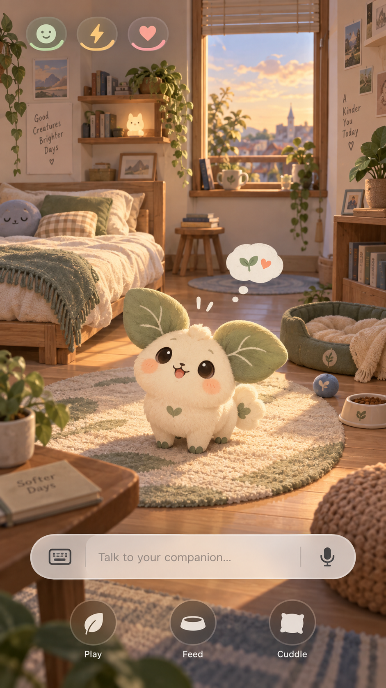

# JevPet

JevPet 是一个“会生活在房间里”的虚拟互动宠物实验。它把可预测的本地行为、可组合的动态 UI，以及可选的 Jev/低成本语言模型结合起来，让宠物看起来有连续的状态和个性，同时保持足够快、可测试、可离线运行。

> 项目刚完成初始化，目前以产品边界、架构约定和跨设备协作为主；应用代码将在第一个垂直切片中创建。

<p align="center">
  
</p>

这张图是视觉方向参考：房间是主舞台，宠物是持续生活在其中的角色；它不是最终 UI 或可直接发布的美术资产。

## 核心思路

```text
用户事件 / 时间事件
        ↓
  宠物与房间状态
        ↓
本地规则 或 Jev 决策器
        ↓
受限、可校验的行为计划
        ↓
行为执行器 + 动态 UI
        ↓
动画、声音、状态变化与存档
```

Jev 不直接生成并执行任意代码。它只从应用注册的能力中选择和组合动作，例如 `pet.walk_to`、`pet.play_animation`、`pet.speak`。真正的代码、参数范围、超时、冲突和回退逻辑都由应用控制。

## 第一版体验

- 打开后进入一个温暖的小房间。
- 宠物拥有情绪、精力、饱腹、亲密度和当前位置。
- 点击、呼唤、喂食、玩耍和时间流逝会触发不同动作组合。
- 普通互动离线即可完成；复杂意图再交给 Jev 规划。
- 模型响应期间宠物会先做即时反馈，不让用户面对“卡住的 UI”。
- 每一次事件、决策和状态变化都可记录、回放和调试。

更完整的范围见 [产品说明](docs/PRODUCT.md)，技术边界见 [架构说明](docs/ARCHITECTURE.md)，从 Jev 调研到虚拟宠物的推理过程见 [项目探索摘要](docs/DISCOVERY.md)。

## 计划技术栈

- 客户端：Flutter
- 2D 场景与游戏循环：Flame
- 动画资产：第一阶段对比序列帧与 Rive 后再定
- 本地存档：SQLite
- 智能决策：Jev 服务，可降级为本地规则
- 平台顺序：Windows 开发预览 → Android → Web；iOS 后续评估

## 开始工作

1. 阅读 `AGENTS.md`。
2. 阅读 `docs/HANDOFF.md`，从第一个未完成事项继续。
3. 检查本机环境：

```powershell
.\scripts\setup.ps1
```

4. 提交前检查：

```powershell
.\scripts\check.ps1
```

## 跨电脑约定

- 一个功能对应一个 `codex/` 分支。
- 收工前更新 `docs/HANDOFF.md`，提交并推送。
- 换电脑后先拉取分支，再让 Codex 阅读 `AGENTS.md` 和 `docs/HANDOFF.md`。
- `.env`、API Key、本地数据库、构建目录不进入 Git。

建议给 Codex 的续作提示：

```text
阅读 AGENTS.md、docs/PRODUCT.md、docs/ARCHITECTURE.md 和
docs/HANDOFF.md，再查看 git status 与最近 5 个提交。从 HANDOFF.md
第一个未完成事项继续，不要重做已完成内容。结束前运行检查并更新交接文档。
```

## 当前阶段

当前里程碑是“垂直切片”：一个房间、一个临时宠物、一次点击互动、一个可持久化状态。具体任务见 [路线图](docs/ROADMAP.md)。
